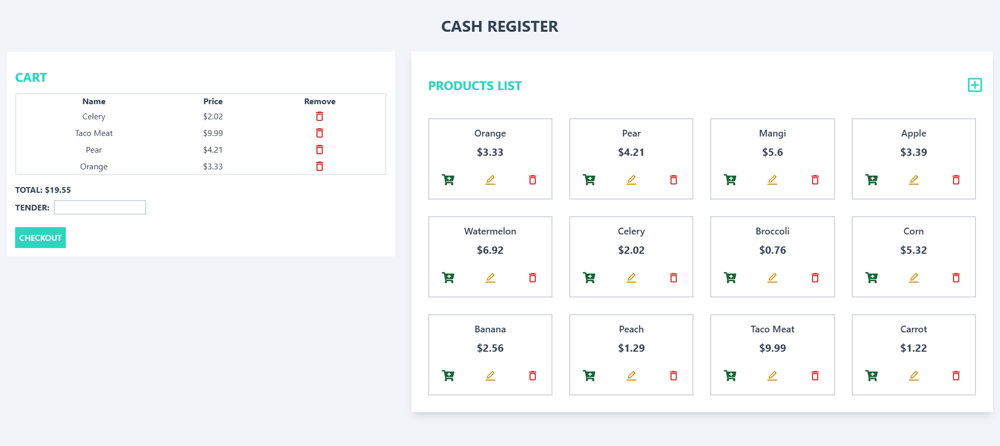

# Cash Register Project

 <!-- Replace with an appropriate image -->

The Cash Register Project is a web application designed to manage products and shopping cart functionality. Built using React and Vite, this application allows users to view products, add them to a cart, and manage their shopping list seamlessly. The application is deployed on Vercel, providing a fast and responsive user experience.

### Live Demo
Check out the live version of the application: [Cash Register Project](https://cash-register-project-three.vercel.app/) (Backend currently not live)

## Features
- **Product Management**: View a list of available products with details.
- **Cart Functionality**: Add, update, and delete items in your shopping cart.
- **User-Friendly Interface**: A clean and intuitive design for easy navigation.

## Technologies Used
- **Frontend**: React, Vite
- **Backend**: Express.js (for development purposes)
- **Database**: MongoDB Atlas
- **Deployment**: Vercel
- **Styling**: CSS / Tailwind CSS (or any styling framework you are using)

## Getting Started

### Prerequisites
Make sure you have the following installed:
- Node.js
- npm (Node package manager)

### Installation
- Clone the repository:
```
  git clone https://github.com/richiethie/cash-register-project.git
```
Navigate to the project directory:
```
cd cash-register-project
```
Install dependencies:
```
npm install
```
Set up your .env file with your MongoDB URI:
```
ATLAS_URI=your_mongodb_uri_here
```
Run the application:
```
cd client
npm run dev
cd ../server
node server.js
```
Open your browser and navigate to http://localhost:${PORT}.

## API Endpoints
- GET /api/cart: Fetch all cart items.
- POST /api/cart: Add a new cart item.
- DELETE /api/cart?id=ID: Delete a cart item by ID.
- PUT /api/cart?id=ID: Update a cart item by ID.

## Contributing
Contributions are welcome! If you have suggestions or improvements, feel free to create a pull request or open an issue.

## License
This project is licensed under the MIT License.
